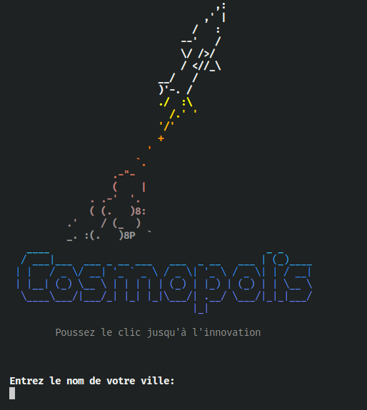
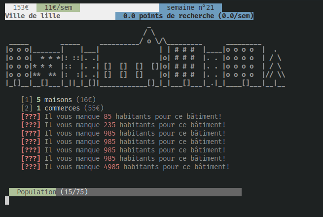

# Cosmopolis

Jeu incrémental et passif (idle game) en mode texte dans lequel nous devons créer une ville dans l'objectif de faire décoller une fusée avec succès 

| Aperçu 1 | Aperçu 2 |
|---|---|
|   |   |

### Génération de l'UML

**IMPORTANT: Déplacer le dossier 'tests' à la racine du projet pour éviter des erreurs de compilation de la part de javadoc.**

```
$ javadoc -d uml -private -sourcepath src -docletpath lib/umldoclet-2.1.0.jar -doclet nl.talsmasoftware.umldoclet.UMLDoclet -subpackages com.cosmopolis
```